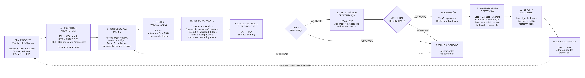

# Pipeline DevSecOps Proposto

O pipeline DevSecOps foi elaborado considerando o sistema de delivery desenvolvido ao longo do projeto, composto pelos módulos de cliente, empresa/restaurante, entregador, administração e integração com o serviço de pagamentos.

O objetivo do pipeline é garantir que uma nova alteração somente avance para implantação após passar pelas verificações de qualidade e segurança definidas para o projeto.

Os riscos prioritários identificados anteriormente orientam essas verificações, principalmente:

- **R04:** comprometimento de conta administrativa;
- **R11:** exposição de dados pessoais dos clientes;
- **R16:** indisponibilidade da API de pagamentos.

Esses riscos deram origem aos requisitos de segurança **RS01, RS02 e RS03** e às decisões arquiteturais **DA01, DA02 e DA03**, considerados durante as etapas do pipeline.

## Diagrama do Pipeline

O pipeline DevSecOps proposto segue o fluxo:

**Planejamento e análise de ameaças → Requisitos e arquitetura → Implementação segura → Testes automatizados → Testes de pagamento → Análise de código e dependências → Gate de segurança → Teste dinâmico com OWASP ZAP → Gate final → Implantação → Monitoramento e detecção → Resposta a incidentes → Feedback contínuo.**

Figura 1 — Pipeline DevSecOps proposto para o Sistema de Delivery

O fluxo possui pontos de controle, chamados de **gates de segurança**, responsáveis por impedir que uma versão avance quando alguma condição de segurança considerada obrigatória não for atendida.

No caso do serviço de pagamentos, os testes de integração devem considerar situações como indisponibilidade do gateway, timeout, repetição de requisições e prevenção de operações duplicadas, de acordo com o risco **R16**, o requisito **RS03** e a decisão arquitetural **DA03**.

# Atividades e Gates de Segurança

## Atividades, Evidências e Condições do Pipeline

| **Momento** | **Atividade de segurança** | **Evidência produzida** | **Condição para continuar** |
| --- | --- | --- | --- |
| **Planejamento** | STRIDE, casos de abuso e análise de riscos | Tabela de ameaças, casos de abuso e registro de riscos | Riscos prioritários identificados e analisados |
| **Arquitetura** | Definição dos requisitos RS01, RS02 e RS03 e das decisões DA01, DA02 e DA03 | Requisitos de segurança e diagrama de arquitetura segura | Controles definidos para os riscos prioritários |
| **Implementação** | Aplicação de práticas de código seguro | Código, pseudocódigo e implementação dos controles | Práticas de segurança implementadas |
| **Testes** | Testes automatizados de autenticação, autorização, RBAC e menor privilégio | Resultado dos testes automatizados | Testes obrigatórios aprovados |
| **Pagamentos** | Testes de integração com o serviço de pagamentos | Resultados dos testes de integração e cenários de falha | Sem inconsistência no pedido ou duplicidade de operações |
| **Análise de código** | SAST e Secret Scanning | Relatório das análises | Sem vulnerabilidade crítica não analisada ou segredo exposto |
| **Dependências** | SCA para identificação de componentes vulneráveis | Relatório de dependências | Sem dependência crítica conhecida sem tratamento |
| **Verificação** | Teste dinâmico com OWASP ZAP | Relatório de alertas da ferramenta | Achados críticos analisados |
| **Implantação** | Liberação da versão que passou pelos gates de segurança | Registro da versão aprovada | Verificações obrigatórias aprovadas |
| **Operação** | Logs, eventos e regras de detecção | Logs, alertas e registros de segurança | Eventos suspeitos analisados |
| **Resposta** | Investigação, contenção e correção de incidentes | Registro do incidente e das ações realizadas | Incidente tratado e melhoria incorporada ao ciclo |

## Condições que Impedem a Continuidade do Pipeline

O pipeline deve impedir que uma versão avance quando uma condição de segurança obrigatória não for atendida.

1. **Teste automatizado ou teste de segurança reprovado.** Caso um teste obrigatório apresente falha, a versão deve retornar para correção antes de continuar.
2. **Vulnerabilidade crítica não analisada.** Uma vulnerabilidade crítica deve ser analisada e tratada ou possuir justificativa documentada.
3. **Segredo encontrado no repositório.** Senhas, tokens, chaves de API e credenciais não devem permanecer diretamente no código ou repositório.
4. **Dependência com vulnerabilidade crítica conhecida.** Uma dependência crítica conhecida e sem tratamento impede o avanço.
5. **Falha no controle de acesso.** Um cliente, por exemplo, não pode acessar funcionalidades exclusivas do administrador.
6. **Falha crítica na integração com pagamentos.** Cobrança duplicada, inconsistência no pedido ou tratamento inadequado da indisponibilidade impedem o avanço.

Após a correção do problema identificado, as verificações devem ser executadas novamente.

# Ferramentas Propostas para o Pipeline DevSecOps

Como não é necessária a implementação real do pipeline, as ferramentas representam tecnologias que poderiam ser utilizadas para automatizar as verificações propostas.

| **Atividade** | **Ferramenta sugerida** | **Finalidade** |
| --- | --- | --- |
| Versionamento | Git e GitHub | Versionamento do código e revisão das alterações |
| Testes automatizados | Pytest | Execução dos testes do backend |
| SAST | CodeQL ou Semgrep | Identificação de possíveis vulnerabilidades no código |
| SCA | Dependabot ou OWASP Dependency-Check | Identificação de dependências com vulnerabilidades conhecidas |
| Secret Scanning | Gitleaks | Identificação de senhas, tokens e chaves expostas |
| Testes de pagamento | Sandbox do provedor | Simulação da integração com o serviço de pagamentos |
| DAST | OWASP ZAP | Verificação da aplicação durante sua execução |
| Monitoramento | Logs e alertas da aplicação | Identificação de eventos e comportamentos suspeitos |

As ferramentas propostas cobrem diferentes momentos do pipeline, desde o versionamento e os testes automatizados até a análise estática, análise de dependências, identificação de segredos, testes dinâmicos e monitoramento.

A combinação dessas verificações permite identificar problemas de segurança antes da implantação e acompanhar possíveis eventos de segurança durante a operação.
